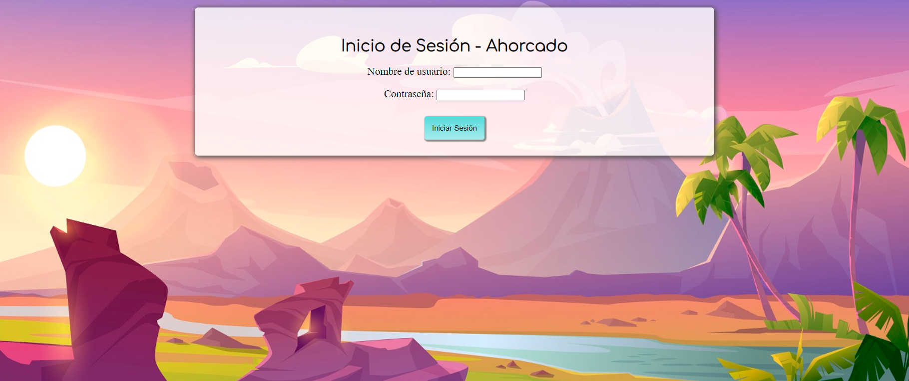
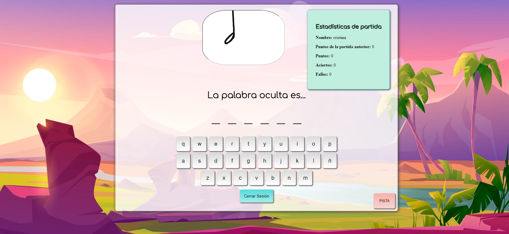
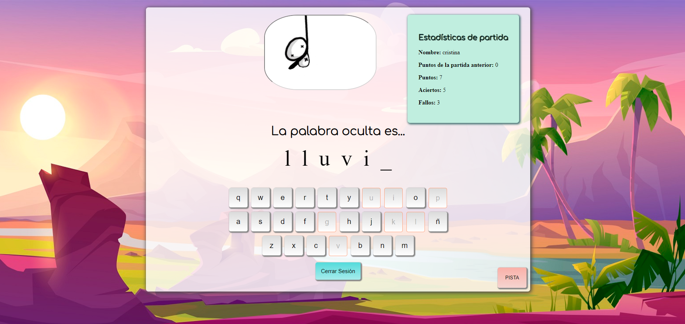
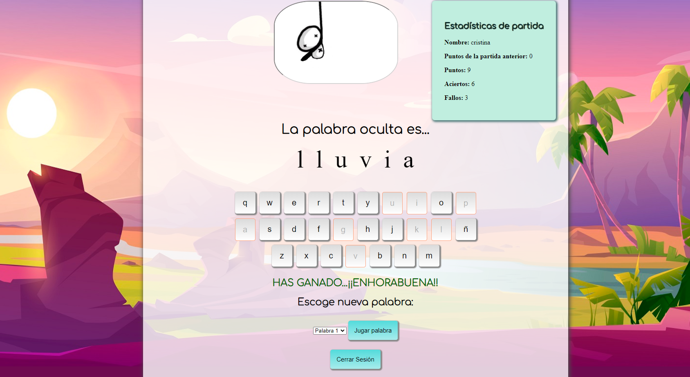

# HangmanJSTL
 ·Play the game and store your results in a session.      ·Generate random words from a XML file      ·See your previous score      ·I designed the website with CSS3

# TO RUN THIS PROJECT:
  -->Install Tomcat  
  -->Add jstl jar to Tomcat lib directory  
  -->Copy this file to Tomcat webapps directory  
  -->Turn on Tomcat  
  -->Access to localhost:yourport/HangmanJSTL/  (for example: http://localhost:8082/HangmanJSTL/)  
  -->Enjoy the web app!  
  
  
# TO SEE HOW THIS APP LOOKS:

<h2>LOGIN</h2>

<h2>FIRST GAME</h2>

<h2>PLAYING...</h2>

<h2>WINNER!</h2>

